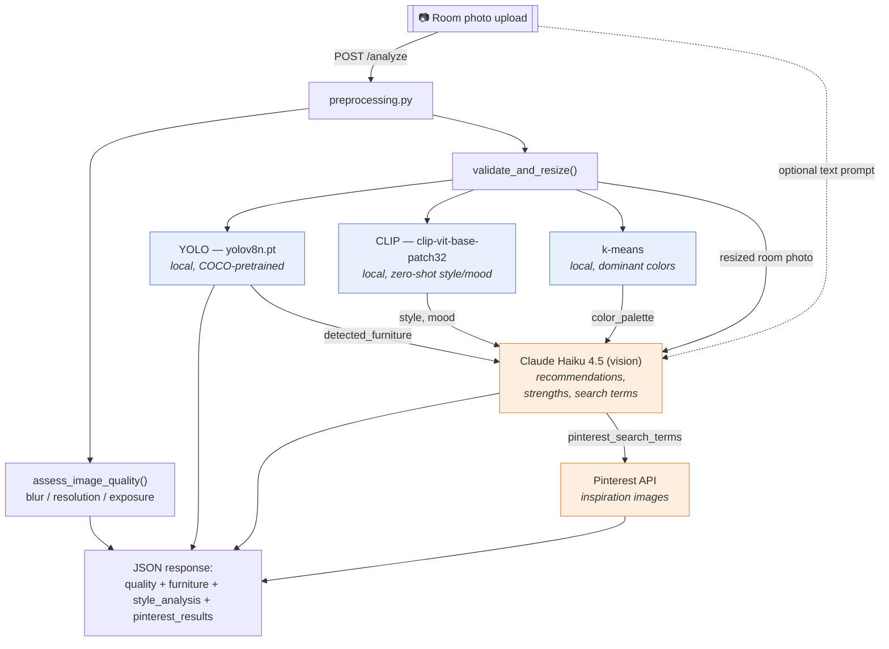

# Room Design Recommender

Upload a photo of a room and get furniture detection, style/mood analysis, and
AI-generated design recommendations, plus matching inspiration pulled from
Pinterest.

## Architecture



Blue steps run locally with no per-request API cost. Orange steps call an
external API. YOLO, CLIP, and k-means run independently off the same
preprocessed image — Haiku is the only step that combines all of their
outputs (plus the user's optional text prompt) into the final recommendations
and Pinterest search terms.

### Pipeline stages

1. **`preprocessing.py`** — decodes the upload, runs objective quality checks
   (blur, resolution, exposure), and resizes for the downstream models.
2. **YOLO** (`feature_extraction.py`) — detects furniture/objects and returns
   labeled, deduplicated bounding-box confidences.
3. **CLIP + k-means** (`style_analysis.py`) — CLIP zero-shot classifies style
   and mood against fixed candidate labels; k-means clusters pixels for the
   dominant color palette. Both are local, free, and run on every request.
4. **Claude Haiku, vision** (`recommendations.py`) — the only generative step;
   sees the resized room photo directly alongside the structured facts from
   steps 2–3 and the user's prompt, so recommendations can reference specific
   visible items, colors, and positions that CLIP/YOLO's fixed label sets miss.
5. **Pinterest** (`pinterest.py`) — searches using Haiku's generated terms for
   inspiration images.

## Running locally

```
source .venv/bin/activate
uvicorn main:app --reload
```

Then open `http://localhost:8000`.
